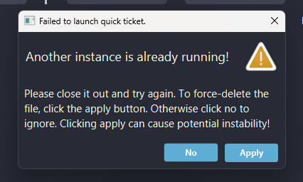
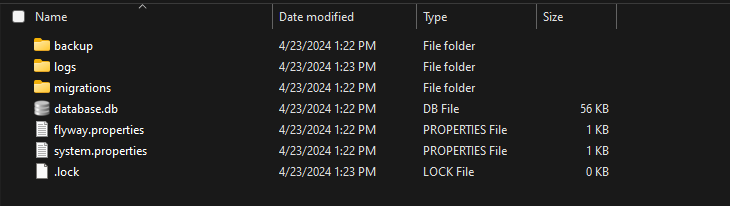

# Failed to launch Quick Ticket.

If you ever encounter this error, that indicates QuickTicket unexpectedly crashed, you lost power, or you started two instances of QuickTicket.

This application does not support running multiple instances because there is no synchronization between the clients. To help mitigate potential incongruencies, there is a file locking mechanism implemented.

*Typically*, when clicking the apply button - this will delete the .lock latch and start QuickTicket up again, regardless.

However, take note that if you decide to utilize multiple clients data will be inconsistent between the two.

To rectify this warning, you may click apply or delete the .lock file manually.

The .lock file is located in your **%Appdata%** directory, following this path:

**C:\Users\[user]\AppData\Roaming\QuickTicket**, there you will find a .lock file like below:

Just delete the .lock file, and restart QuickTicket. This should elevate that warning.

**This does not apply to any other OS, specifically windows.**